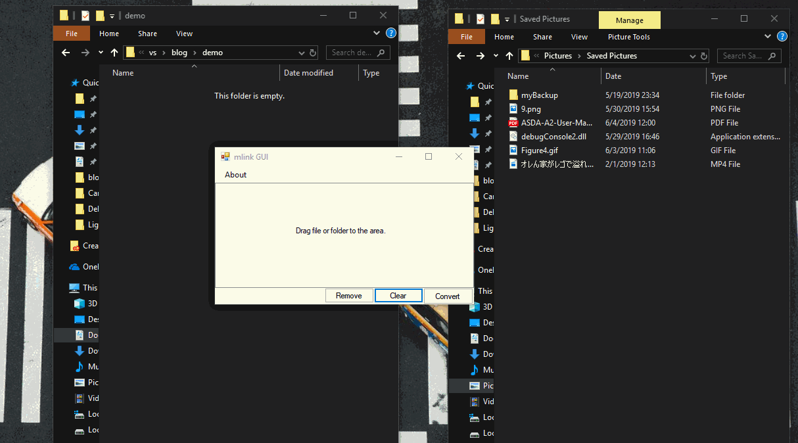

# vSymLinks(mklinkGUI)

A GUI verison of Mklink for Windows creating Symbolic Links. Using original mklink in Windows cmd command. Please also check my blog [Symbolic Links](https://vince-amazing.com/blog/2018/06/28/symbolic-link/).
**(NEED TURN ON "DEVELOPER MODE" TO WORK)**

_Lineng Cao_

## Screenshot



## Original mklink command in Windows
``` bash
# create a file symbolic link so that typing pad.exe will allow you to launch notepad.exe.
mklink pad.exe notepad.exe

# create a symbolic link called fruit that points directly to the folder oranges.
mklink /D c:\fruit c:\apples\bananas\oranges
```

## vSymLinks Usage
- Drag the file or folder into the form
- Click convert and you can move the Symbolic Links in `SymbolicLinks` to anywhere

## Download
## Github
[Exe file](https://gitlab.com/vcec/vsymlinks/blob/master/vSymlink/bin/Debug/vSymlink.exe)

## Windows Store
<a href='//www.microsoft.com/store/apps/9n4skx6602h2?cid=storebadge&ocid=badge'></a>

## License
vSymLinks by Lineng Cao is licensed under a MIT License.
Based on a work at [https://gitlab.com/vcec/vsymlinks](https://gitlab.com/vcec/vsymlinks)